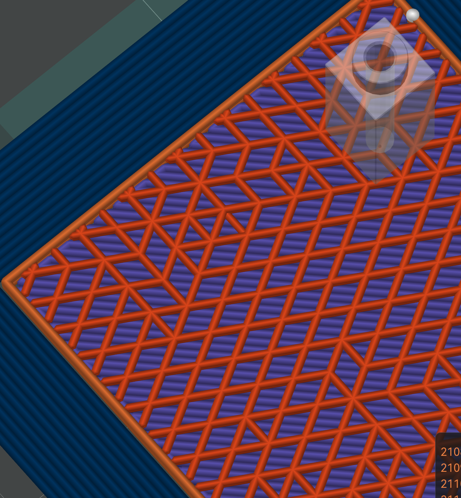
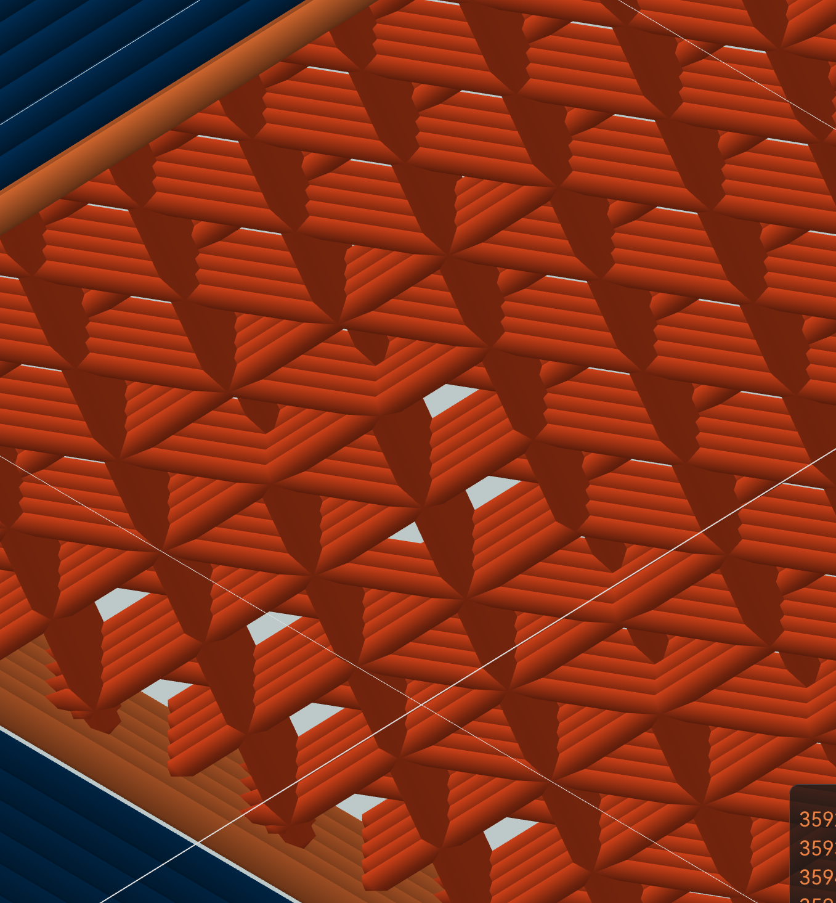
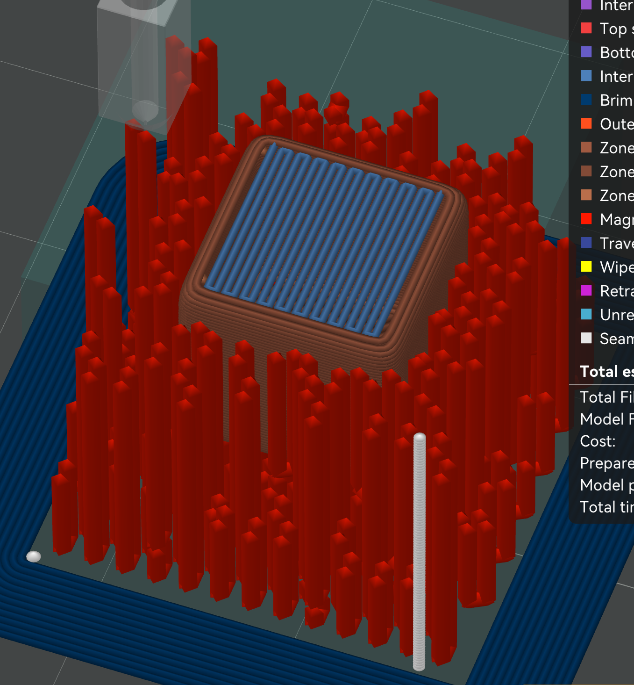
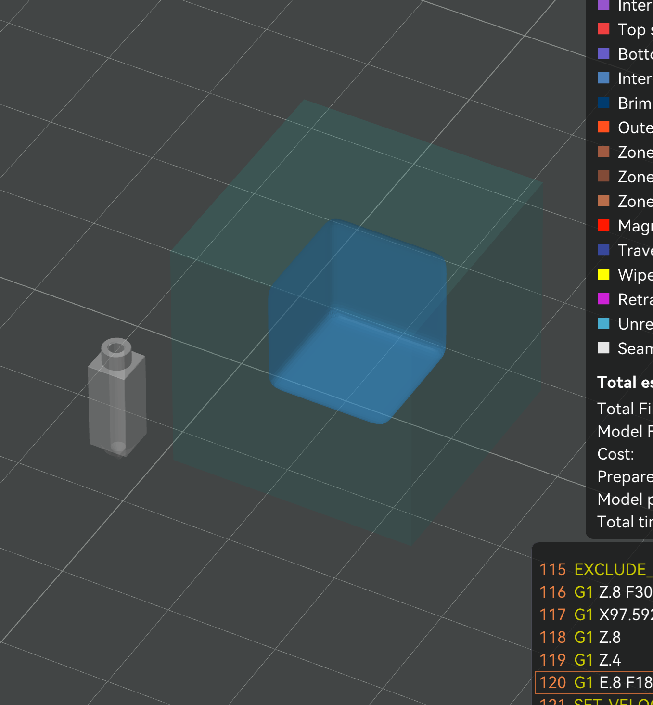
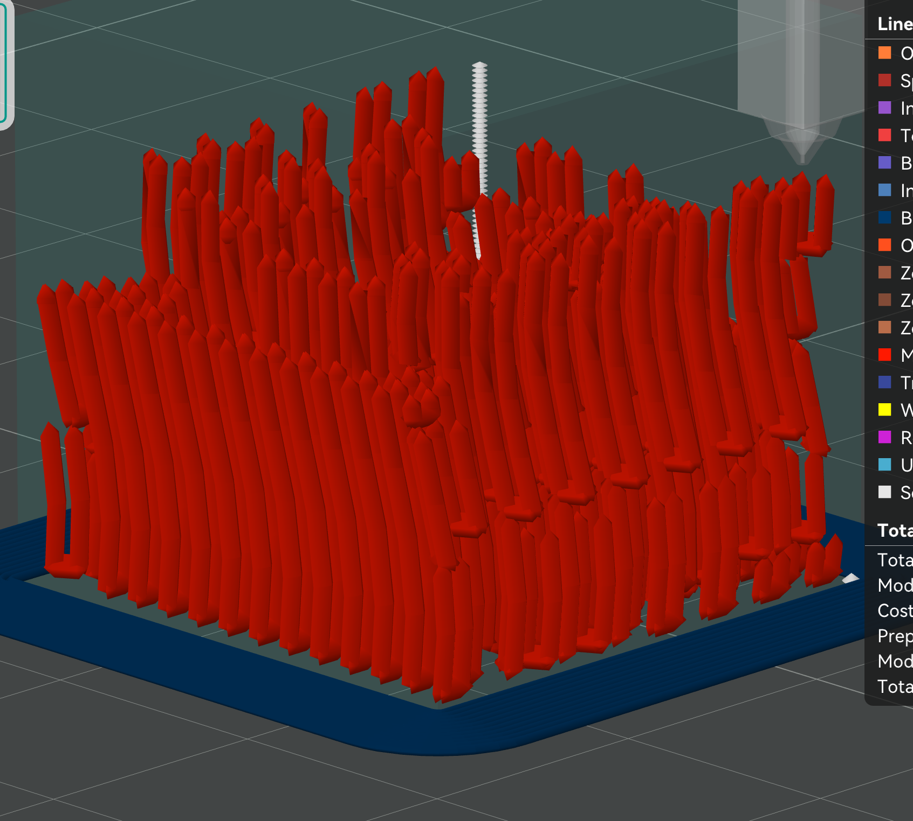
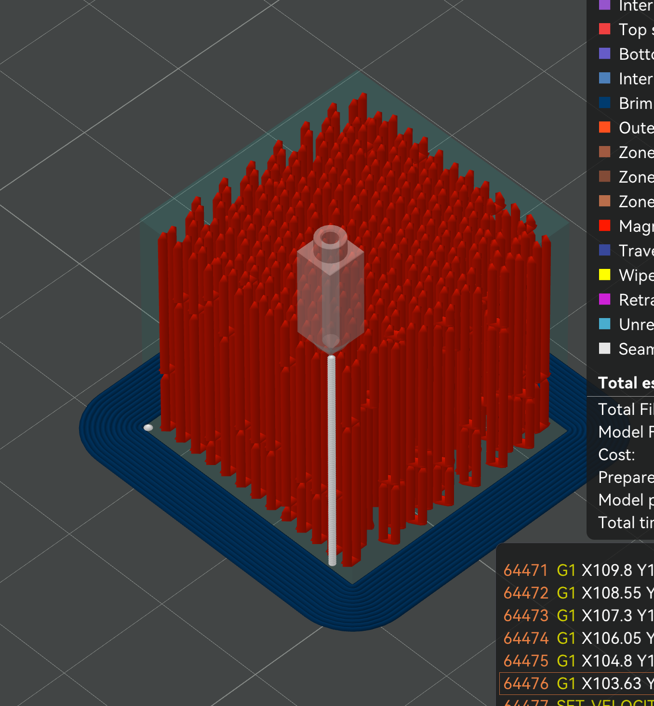

# How Magma works

This is the mechanism in more detail than the [README](README.md), without the math. For the full algorithms and the physics model, see the [defensive publication](DEFENSIVE_PUBLICATION.md). For the tube solver specifically, see [DESIGN-TUBE-SOLVER.md](DESIGN-TUBE-SOLVER.md).

## The lattice

Magma replaces normal infill with a lattice that forms hollow U-shaped vertical channels. These channels are injected at calculated intervals, "knitting" the part together with a 3D lattice. Each lattice cell is a vertical tube. Tubes are paired with their "neighbors" at specified points where "windows" are formed between them. These windows become the bottom of the U-shaped channel, allowing plastic to flow from one side of the tube pair to the other when the nozzle is pressed down onto one of the pairs' tube tops.

The infill itself is a modified version of an ordinary infill pattern, with additional logic for calculating neighboring pairs, ensuring min and max tube height bounds, drawing "windows" at the bottom of assigned tube pairs for injection, and injection code for when the layer reaches the top of each tube. Additionally, there's special rendering code so you can view the tubes and injection process in the slice preview.

### The three patterns

You pick the pattern with `sparse_infill_pattern`:

- **Magma Triangle** — equilateral-triangle cells, three families of 60-degree lines (the original Magma pattern).
- **Magma Rectilinear** — square cells from two perpendicular single-wall line families, with square windows on the shared edge.
- **Magma Tri-hex** — hexagon cells (hubs) with triangle cells filling the gaps (vents). Instead of pairing two cells into a U, one injection fills a *manifold*: a hub plus several equal-length vent legs, all filled in one shot. A second pass hands each still-empty vent to whichever nearby hub-tube can fill the most of it, so fill follows the geometry — more legs in open areas, gracefully down to a plain U-tube where the part is pinched.

| | Cells & lines | Injection unit | Notes / when to use |
|---|---|---|---|
| **Triangle** | equilateral triangles, 3 line families at 60° | U-tube (2 cells) | Packs the most tubes per area, so it's the **default** — maximum reinforcement. Opening/interior seal ratio 2.0 (the nozzle flat has to cover the widest opening). |
| **Rectilinear** | squares, 2 perpendicular families at 90° | U-tube (2 cells) | **Easiest to seal** (ratio √2 ≈ 1.41) and fastest to print (2 straight families, not 3), at fewer tubes per area. Good for blocky / orthogonal parts. |
| **Tri-hex** | hexagon hubs + triangle vents | manifold (hub + N vents) | One injection fills a hub plus many legs, so it covers **open areas** efficiently and degrades gracefully to a plain U-tube where the part pinches. |

All three share the same solver, injection sequence, sealing, and preview — only the cell shape, the window placement, and the line families differ. Pick one with `sparse_infill_pattern` (or, in a dual-zone print, with the outer-zone pattern).

A cell is only kept on a given layer if its clipped cross-section is at least 70% of the ideal cell area and the injection point still has room to seal against its opening (see [the solver](#staggering-the-solver)); pinched or clipped-away cells are dropped, and a tube's injected volume scales with each layer's actual clipped area.

*The orange triangle grid is the Magma zone. Hexagonal gaps are windows.*

## U-tubes and windows

A solver pairs each triangle cell with an edge sharing neighbor and removes a short section of their shared wall at the bottom, leaving a window. The pair becomes a U: two vertical tubes joined at the base.

During injection the nozzle seals against the top of one tube and pushes plastic in. It flows down that side, through the window, and up the partner. Air escapes out the partner's open top. The window is auto-sized to be at least as wide as the tube, so it never bottlenecks the flow.

*Every paired cell has a gap in its shared wall, so plastic flows from one tube into its partner.*

## Staggering (the solver)

If every tube started and ended on the same layers, their ends would line up into a weak horizontal plane, the exact problem Magma is trying to fix. So the solver staggers tube ends across Z, and pairs cells to reinforce as much of the part as possible.

There are two solver modes. Basic is a fast greedy pass (about a second) that covers most of the part. Refined adds a constraint solver (CP-SAT) that improves coverage and stagger at a large time cost, worth it mainly on complex models. The details are in [DESIGN-TUBE-SOLVER.md](DESIGN-TUBE-SOLVER.md).

## Dual Infill Zones

Solid fill is heavy and slow. And most of it doesn't contribute much to part strength. The "shell" of the object is where stress is concentrated, and what gives it strength. 

Existing solutions are varying forms of manual "parts hollowing". This is annoying and creates problems like supports being printed in the part interior.

A better solution is automatic hollowing. A thin shell between the inner and outer zones lets you assign a different infill type to each.

Magma currently supports such a "dual zone" infill. With Magma outer shell, and user selectable inner "yolk". This allows the use of a lightweight infill like lightning in the inner yolk while preserving part strength via the solid Magma outer zone. 

*Red Magma tubes form the outer zone around a solid blue inner zone. The band between them is the zone-boundary shell.*

Press **J** in the preview to toggle the zone-boundary overlay, which shows the computed inner-zone region (raw and smoothed). It is useful for checking how the zones split on complex models.

*The J overlay shows the computed inner zone, handy for diagnosing zone splitting.*

## Spiral interlock (optional, off by default)

With spiral interlock on, the whole lattice rotates slightly each layer, so tubes follow helical paths instead of straight columns. The idea is extra mechanical grip against the surrounding walls. I have not measured whether it actually helps, and it has a real cost: the spiral widens each tube's footprint, so fewer full tubes fit, especially in thin sections. Leave it off unless you are specifically testing it.

*Spiral interlock makes the tubes helical instead of vertical.*

## The injection sequence

Injection runs as the print climbs, not all at the end. At the right height the printer parks motion, drops the nozzle onto a tube top, presses down to seal (z-slam), extrudes the calculated volume, lifts, and moves to the next. With a dedicated injection filament it can switch to a second extruder and material first. Temperature changes during injection use safe parking so the nozzle does not ooze on the part.

*Each red column is one injection event.*

### Sealing depth (z-slam)

The seal happens because the nozzle tip flat (and the cone above it) covers the tube opening when pressed down. A wide flat that already covers the opening only needs a token press; a narrow flat on a tapered tip has to go deeper so the widening cone reaches the opening width. Rather than guess, **Auto Z-slam** computes the depth from geometry — the tube opening, the measured tip flat, and the nozzle cone half-angle: `z_slam = max(0.1, (opening + margin - flat) / (2 * tan(angle)))`, where `margin` is a small seal margin (0.1mm) so the cone clears the opening with room to spare rather than just grazing it. The depth is computed per tube from that tube's actual cap opening, so a tube whose top got clipped narrow gets the deeper press it needs. Auto Z-slam is on by default and recommended; it tracks whatever tube size and nozzle you are running. Turn it off to dial the depth in by hand.

### Plunge (slam-melt)

A single fixed press can lose its seal as pressure builds, letting plastic mushroom out around the nozzle instead of going down the tube. **Plunge** ramps the nozzle a little deeper *through* the injection (from the seal depth down to seal + plunge depth) so the hot tip keeps sinking into the softening tube top and holds the seal shut while the channel fills. The injection extrusion stays at your set volumetric rate the whole time — the nozzle sinks and extrudes together, with the move's feedrate set so the *extrusion* is paced at your rate (the tiny plunge distance would otherwise let the firmware blast the filament out at full speed).

> ⚠️ Because injection extrudes a lot while the nozzle barely moves, **Klipper aborts the print** at the first injection unless you raise `max_extrude_cross_section` (and `max_extrude_only_distance`) in `printer.cfg` — see the [README setup note](README.md#-printer-firmware-setup--required-before-you-print). It can't be set from G-code.

### Crater ironing

Pressing a round nozzle into a triangular tube top always displaces a little plastic into a raised rim around a small crater — and the nozzle picks up a blob that would otherwise string to the next tube. **Crater ironing** is a special ironing pass right after each injection: the nozzle spirals inward over the spot so its angled cone plows the rim back into the crater (pushing it in *and* down) and irons the surface flat, while the motion scrapes the nozzle clean. It hovers over neighbouring cells on the way in — so it never irons a neighbour's air hole shut — and only presses down over its own crater. Travel to the next tube then uses the printer's normal z-hop and avoid-crossing. The pass deposits no plastic, so in the slice preview it shows up under the **Wipe** move type (tagged as Ironing) rather than as an injection — turn on Wipe (or Travel) in the preview's move-type options to see it.

### Injection order

By default the injections on a layer are visited in shortest-travel order. But when two neighbouring cells get injected back-to-back, their combined heat can re-melt the thin walls between them and break the seal. **Spread heat** order fixes that: across every object on the plate it builds a per-layer order that deliberately separates spatially-near injections in time, so heat from one has dissipated before its neighbour is touched. It works like dispersion — repeatedly inject wherever is currently "coolest", treating each past injection as a heat source that fades with both time *and* distance, then a quick cleanup pass fixes any leftover clustering. Because it counts real travel time, a longer hop to a far cell is treated as extra cooling rather than pure cost. It runs in well under a millisecond during slicing and is cached.
