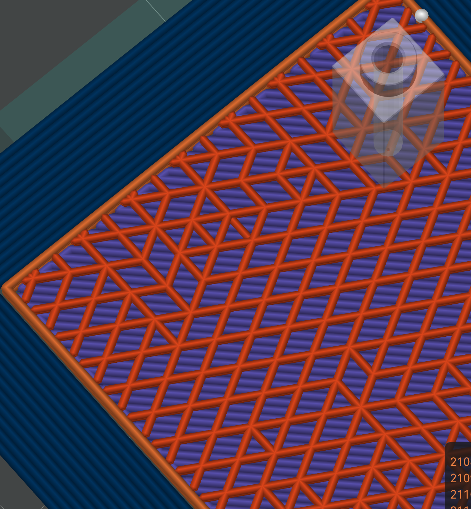
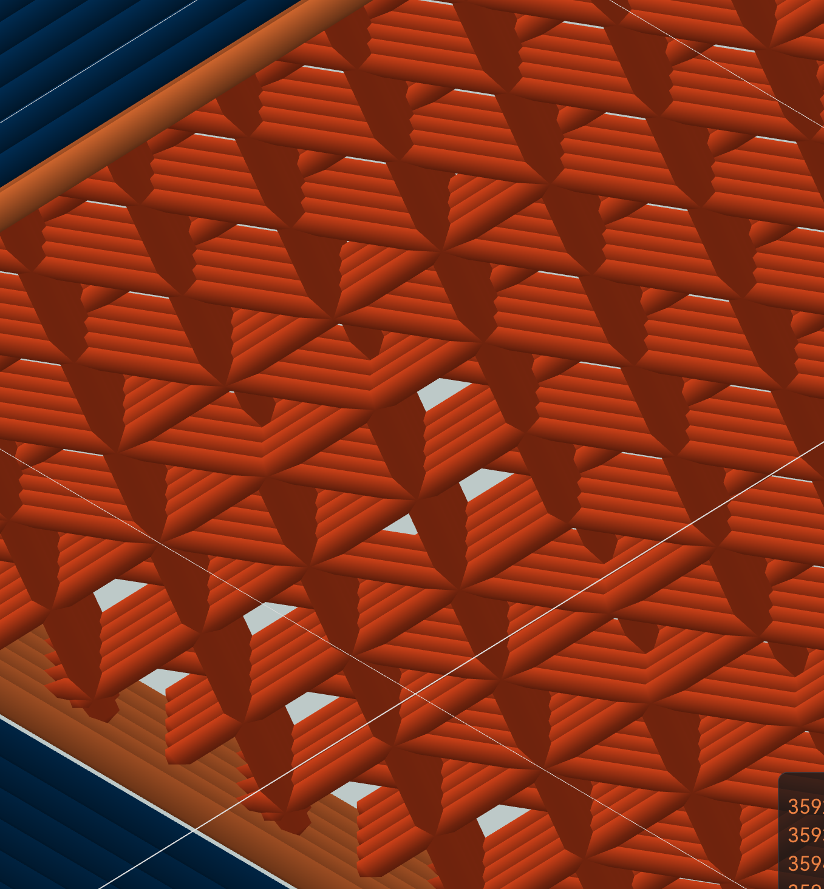
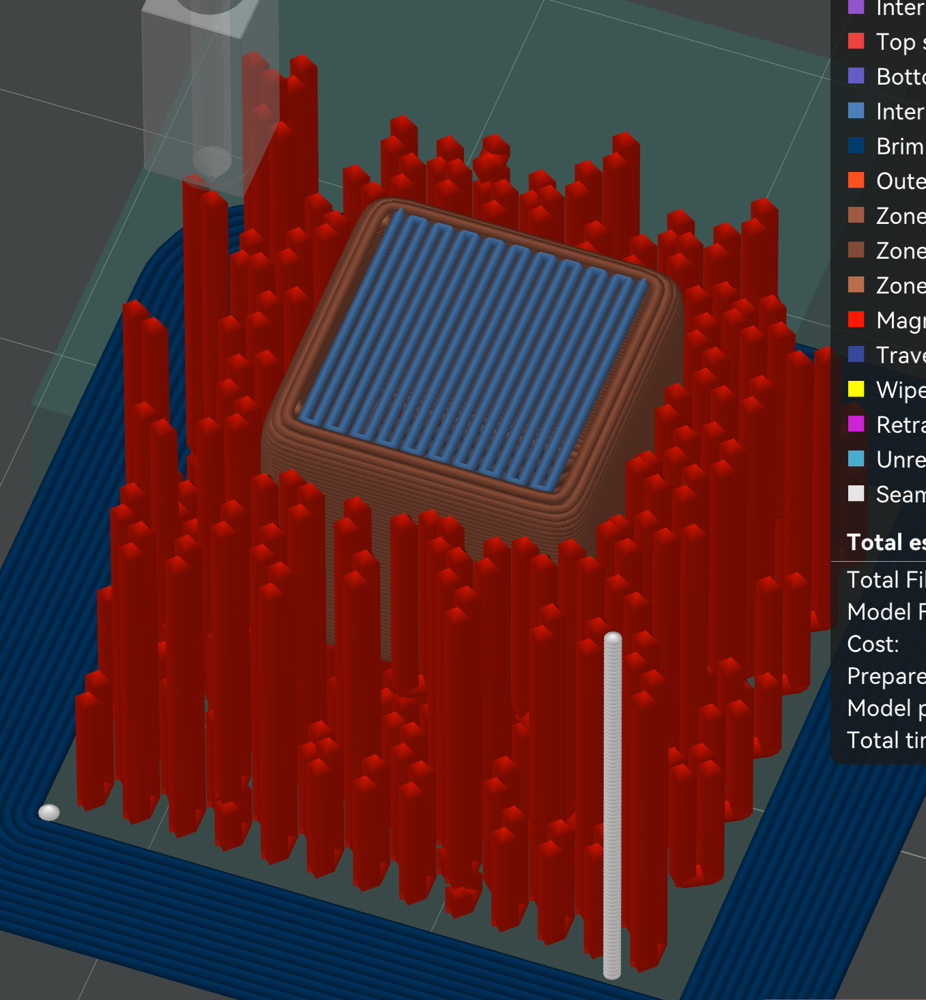
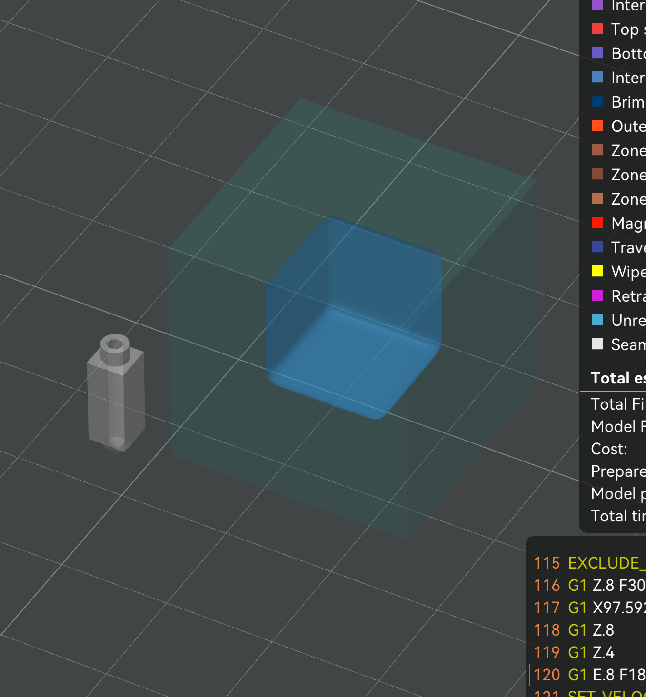
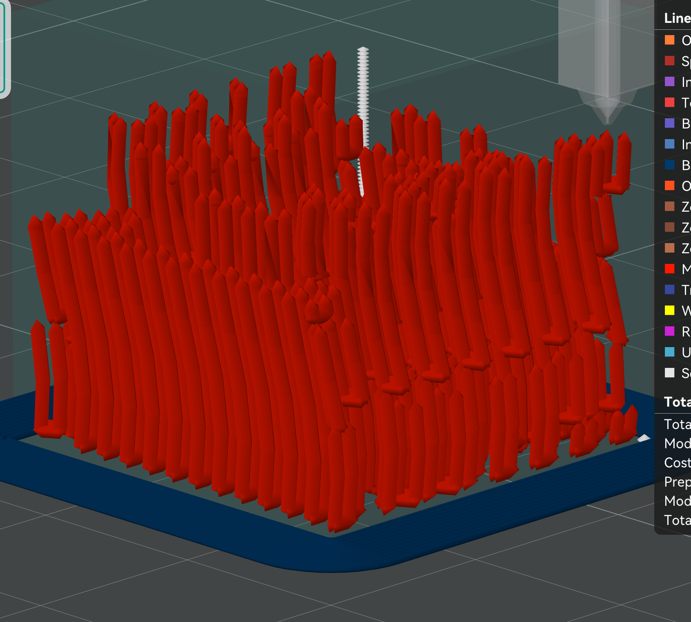
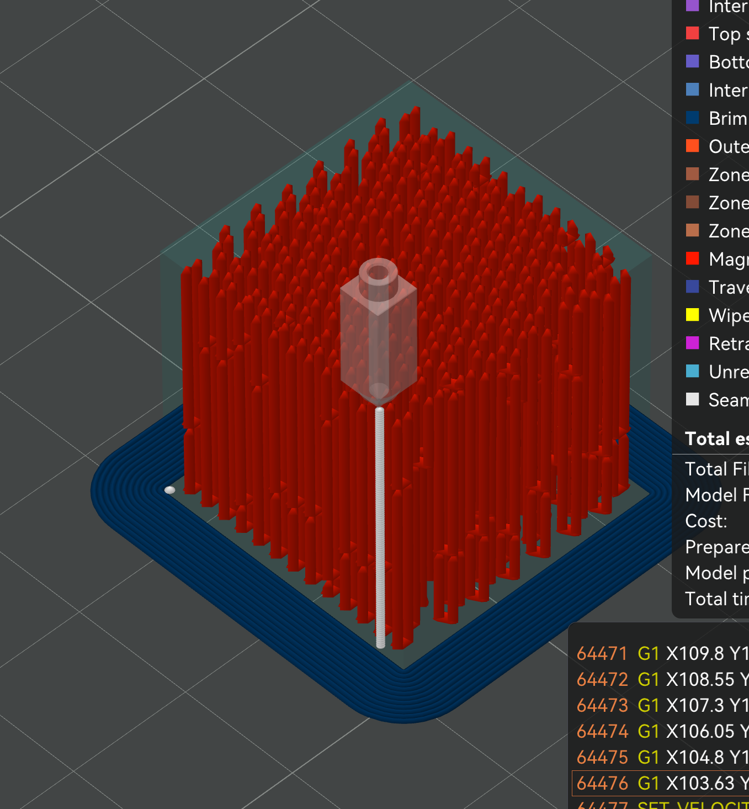

# How Magma works

This is the mechanism in more detail than the [README](README.md), without the math. For the full algorithms and the physics model, see the [defensive publication](DEFENSIVE_PUBLICATION.md). For the tube solver specifically, see [DESIGN-TUBE-SOLVER.md](DESIGN-TUBE-SOLVER.md).

## The lattice

Magma replaces normal infill with a lattice that forms hollow U-shaped vertical channels. These channels are injected at calculated intervals, "knitting" the part together with a 3D lattice. Each lattice cell is a vertical tube. Tubes are paired with their "neighbors" at specified points where "windows" are formed between them. These windows become the bottom of the U-shaped channel, allowing plastic to flow from one side of the tube pair to the other when the nozzle is pressed down onto one of the pairs' tube tops.

The infill itself is a modified version of an ordinary infill pattern, with additional logic for calculating neighboring pairs, ensuring min and max tube height bounds, drawing "windows" at the bottom of assigned tube pairs for injection, and injection code for when the layer reaches the top of each tube. Additionally, there's special rendering code so you can view the tubes and injection process in the slice preview.

### The four patterns

Honeycomb, Rectilinear, Triangle and Tri-hex, chosen with `sparse_infill_pattern`. Cell size
comes from the tube interior width, not the infill density. They differ in cell shape, window
placement and line families; the solver, injection sequence, sealing and preview are shared.
Rectilinear is the default. See [PATTERNS.md](PATTERNS.md) for how they compare and which to
use.

A cell is only kept on a given layer if its clipped cross-section is at least 70% of the ideal cell area and the injection point still has room to seal against its opening (see [the solver](#staggering-the-solver)); pinched or clipped-away cells are dropped, and the volume injected into each tube is measured directly from the printed lattice, layer by layer (see [How much gets injected](#how-much-gets-injected)).

*The orange triangle grid is the Magma zone. Hexagonal gaps are windows.*

## U-tubes and windows

A solver pairs each triangle cell with an edge sharing neighbor and removes a short section of their shared wall at the bottom, leaving a window. The pair becomes a U: two vertical tubes joined at the base.

During injection the nozzle seals against the top of one tube and pushes plastic in. It flows down that side, through the window, and up the partner. Air escapes out the partner's open top. The window is auto-sized to be at least as wide as the tube, so it never bottlenecks the flow.

*Every paired cell has a gap in its shared wall, so plastic flows from one tube into its partner.*

## Staggering (the solver)

If every tube started and ended on the same layers, their ends would line up into a weak horizontal plane, the exact problem Magma is trying to fix. So the solver staggers tube ends across Z, and pairs cells to reinforce as much of the part as possible.

There are two solver modes. Basic is a fast greedy pass (about a second) that covers most of the part. Refined adds a constraint solver (CP-SAT) that improves coverage and stagger at a large time cost, worth it mainly on complex models. The details are in [DESIGN-TUBE-SOLVER.md](DESIGN-TUBE-SOLVER.md).

## Dual Infill Zones

Solid fill is heavy and slow. And most of it doesn't contribute much to part strength. The "shell" of the object is where stress is concentrated, and what gives it strength.

Existing solutions are varying forms of manual "parts hollowing". This is annoying and creates problems like supports being printed in the part interior.

A better solution is automatic hollowing. A thin shell between the inner and outer zones lets you assign a different infill type to each.

Magma currently supports such a "dual zone" infill. With Magma outer shell, and user selectable inner "yolk". This allows the use of a lightweight infill like lightning in the inner yolk while preserving part strength via the solid Magma outer zone.

*Red Magma tubes form the outer zone around a solid blue inner zone. The band between them is the zone-boundary shell.*

Press **J** in the preview to toggle the zone-boundary overlay, which shows the computed inner-zone region (raw and smoothed). It is useful for checking how the zones split on complex models.

*The J overlay shows the computed inner zone, handy for diagnosing zone splitting.*

## Spiral interlock (optional, off by default)

With spiral interlock on, the whole lattice rotates slightly each layer, so tubes follow helical paths instead of straight columns. The idea is extra mechanical grip against the surrounding walls. I have not measured whether it actually helps, and it has a real cost: the spiral widens each tube's footprint, so fewer full tubes fit, especially in thin sections. Leave it off unless you are specifically testing it.

*Spiral interlock makes the tubes helical instead of vertical.*

## The injection sequence

Injection runs as the print climbs, not all at the end. At the right height the printer parks motion, drops the nozzle onto a tube top, presses down to seal, extrudes the calculated volume, lifts, and moves to the next. With a dedicated injection filament it can switch to a second extruder and material first. Temperature changes during injection use safe parking so the nozzle does not ooze on the part.

*Each red column is one injection event.*

### How much gets injected

The volume pushed into each U-tube is **measured from the actual printed toolpath**, not estimated from the cell geometry. Magma walks each layer of a tube's run, takes the open void (the pair's cells inside the Magma zone, minus the walls actually deposited there) and multiplies by layer height. Summed up the run, that is the real injectable cavity.

Because it measures leftover air, one calculation covers doubled walls, overlapping line crossings, the window gap and cells clipped by the part edge, with no per-pattern math. Crossings deposit plastic twice and that material is subtracted too, so the number can never over-inject. Honeycomb is the exception: its corners are three wall *ends* meeting at 120°, not crossings, so there is nothing to subtract.

### Sealing depth

The seal happens because the nozzle tip flat (and the cone above it) covers the tube opening when pressed down. A wide flat that already covers the opening only needs a token press; a narrow flat on a tapered tip has to go deeper so the widening cone reaches the opening width. The depth geometry demands is `(opening - flat) / (2 * tan(angle))`, and Magma then descends a little further — the **seal press** (0.1mm by default) — because covering a cell is not the same as gripping it. At first contact the nozzle is resting on the opening, not sealing it, and a printed rim is never as flat as the model says.

Below about **0.4mm of total seal depth** that engagement is unreliable and tubes leak, whatever the geometry says. The slicer warns you. Note what sets it: the depth comes from how much *wider* the cell is than your nozzle flat, so a cell only slightly wider than the flat is reached almost immediately. **Your nozzle's flat therefore sets a minimum cell size**, and a smaller flat is what lets you run smaller cells.

Tube width is the setting; seal depth is the consequence. The readout in the slicer shows the depth your chosen tube costs on your nozzle, along with the resulting injection time — which is the number that actually decides whether the print is clean. See [TUNING.md](TUNING.md).

### Plunge

A single fixed press can lose its seal as pressure builds, letting plastic mushroom out around the nozzle instead of going down the tube. **Plunge** ramps the nozzle deeper *through* the injection, from seal depth down to seal + plunge depth, so the hot tip keeps sinking into the softening tube top and holds the seal shut while the channel fills.

The nozzle sinks and extrudes together. The move's feedrate is set so the *extrusion* is paced at your volumetric rate, since the tiny plunge distance would otherwise let the firmware blast the filament out at full speed.

> ⚠️ Because injection extrudes a lot while the nozzle barely moves, **Klipper aborts the print** at the first injection unless you raise `max_extrude_cross_section` (and `max_extrude_only_distance`) in `printer.cfg` — see the [README setup note](README.md#-printer-firmware-setup--required-before-you-print). It can't be set from G-code.

### Crater ironing

Pressing a round nozzle into a tube top displaces plastic into a raised rim around a small crater, and the nozzle picks up a blob that would otherwise string to the next tube. **Crater ironing** runs right after each injection: the nozzle spirals inward over the spot so its angled cone plows the rim back into the crater and irons the surface flat, while the motion scrapes the nozzle clean.

It hovers over neighbouring cells on the way in so it never irons a neighbour's air hole shut, and presses down only over its own crater. The pass deposits no plastic, so the preview shows it under the **Wipe** move type (tagged as Ironing) rather than as an injection. Turn on Wipe or Travel in the preview's move-type options to see it.

### Injection order

By default the injections on a layer are visited in shortest-travel order. But when two neighbouring cells get injected back-to-back, their combined heat can re-melt the thin walls between them and break the seal. **Spread heat** order fixes that. Across every object on the plate it builds a per-layer order that separates spatially-near injections in time, so heat from one dissipates before its neighbour is touched. It works by dispersion: repeatedly inject wherever is currently coolest, treating each past injection as a heat source fading with both time and distance, then a cleanup pass fixes leftover clustering. Because it counts real travel time, a long hop to a far cell counts as extra cooling rather than pure cost. It runs in well under a millisecond and is cached.
